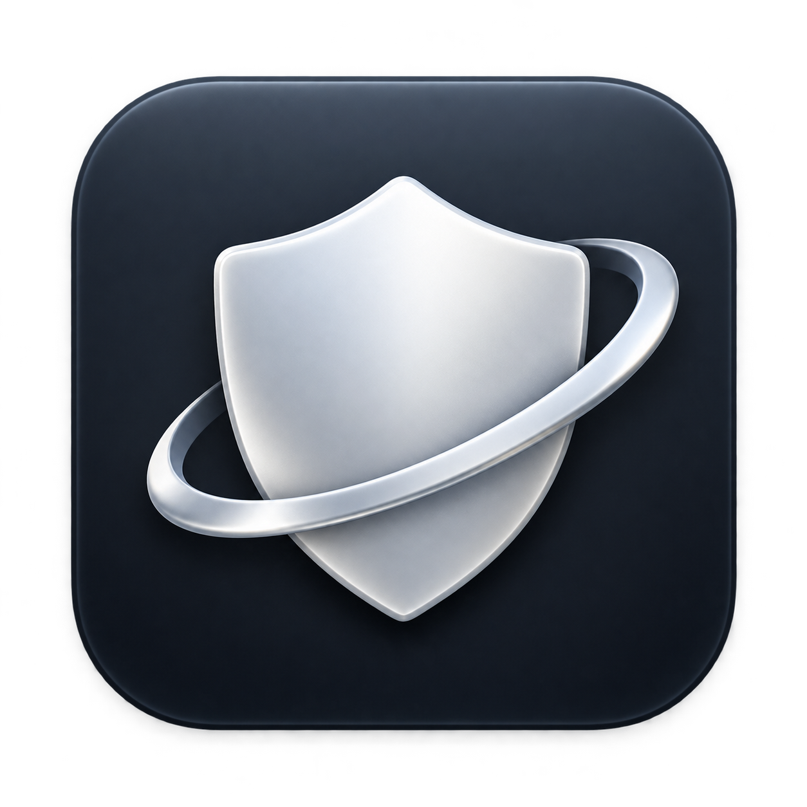
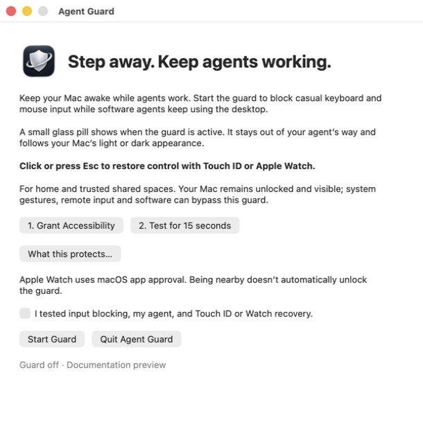
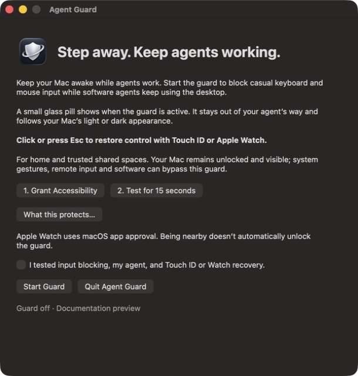
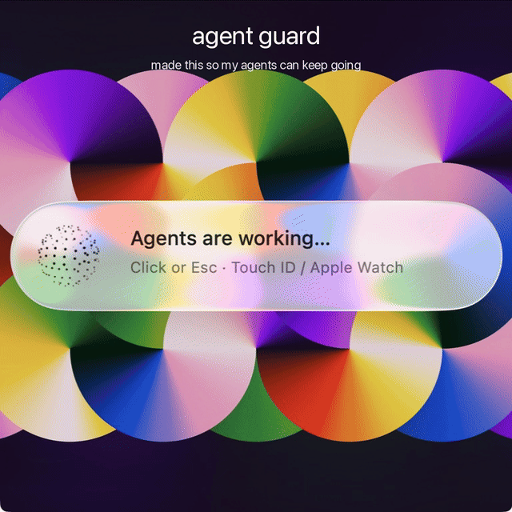

<p align="center"></p>
<h1 align="center">Agent Guard</h1>
<p align="center"><strong>keep your mac unlocked for your agents — not strangers</strong></p>
<p align="center">Keeps your MacBook awake and the screen clear for agents, while blocking most physical input.</p>
<p align="center"><a href="https://github.com/KartikC/agent-guard/releases/download/v0.2.1/AgentGuard-0.2.1-arm64.dmg">Download for Apple silicon</a> · <a href="docs/QUICKSTART.md">Get started</a> · <a href="docs/media/agent-guard-x.mp4?raw=true">Watch the 6-second demo</a></p>

Agent Guard keeps your Mac awake and blocks ordinary physical keyboard and pointer input, while allowing software agents to keep using the desktop. Come back, click or press **Esc**, and approve with **Touch ID or Apple Watch**.

Built for home, trusted coworkers, and those “I need to step away, but the agent is still working” moments.

<p align="center">
  
  
</p>

<p align="center"><a href="https://github.com/KartikC/agent-guard/releases/download/v0.2.1/agent-guard-x.mp4"></a></p>

### Why it’s useful

- **Keep the work going.** Keeps the Mac and display awake during the active session.
- **Stay out of the way.** A small, click-through glass pill with the “solving” orb.
- **Return with approval.** Touch ID or Apple Watch; no proximity-only unlock.
- **Feel at home on macOS.** Follows system light/dark appearance, Reduce Motion, and Reduce Transparency.
- **Try it safely first.** The 15-second test restores input automatically.
- **Stay local.** No account, network calls, analytics, or keystroke logging in the app.

### What it isn’t

**An input guard, not a macOS lock screen.** Your session stays unlocked and visible. System gestures, remote control, remappers, or software input can bypass the guard. A crash or process termination stops protection; the ordinary physical Force Quit shortcut is filtered while the guard works. Agent input is allowed using a process-ID heuristic, not a trusted-agent security boundary.

It adds friction against casual interaction; it does not protect an unattended Mac from a determined person. Use the real lock screen when you need that protection. [Security details →](SECURITY.md)

### Install

1. [Download the DMG](https://github.com/KartikC/agent-guard/releases/download/v0.2.1/AgentGuard-0.2.1-arm64.dmg), open it, and drag **Agent Guard** into **Applications**.
2. Open the app and grant **Accessibility** when requested.
3. Run **Test for 15 seconds**. Check physical input, your actual agent, and Touch ID/Watch recovery.
4. Check the confirmation box, then choose **Start Guard**. This first-time confirmation is remembered on future launches.

Requires an **Apple-silicon Mac (M-series), macOS 13+**, and working Touch ID or supported Apple Watch app approval. Native Liquid Glass uses macOS 26+; older versions use a native translucent material. Intel is not included in this build.

**Distribution status:** this initial DMG is ad-hoc signed, not Developer ID signed or notarized. macOS may block an internet download. Only approve software you trust; building from source is also available. [Checksums](downloads/SHA256SUMS) · [Installation and recovery](docs/QUICKSTART.md)

### Build from source

Use a current Xcode installation with the macOS 26 SDK (the deployment target remains macOS 13).

```sh
bash test.sh
bash build.sh
open "build/Agent Guard.app"
```

Create the same arm64 DMG with `bash scripts/package-dmg.sh`. No external package manager is needed. See [CONTRIBUTING.md](CONTRIBUTING.md) for development and [AGENTS.md](AGENTS.md) for coding-agent guidance.

### Credits & license

MIT licensed. The native [ThinkingOrbsKit](https://libraries.dev/orbs) renderer by Jakub Antalik and contributors is vendored under MIT with its notice preserved. App icon created with OpenAI image generation. [Third-party notices](THIRD_PARTY_NOTICES.md).

Screenshots show the real AppKit/SwiftUI views in an isolated documentation preview. The preview does not guard input, authenticate, or keep the Mac awake.
